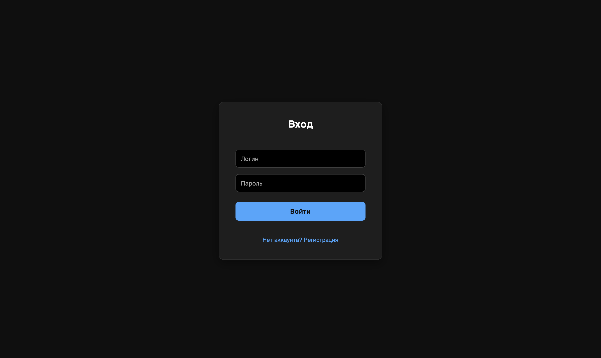
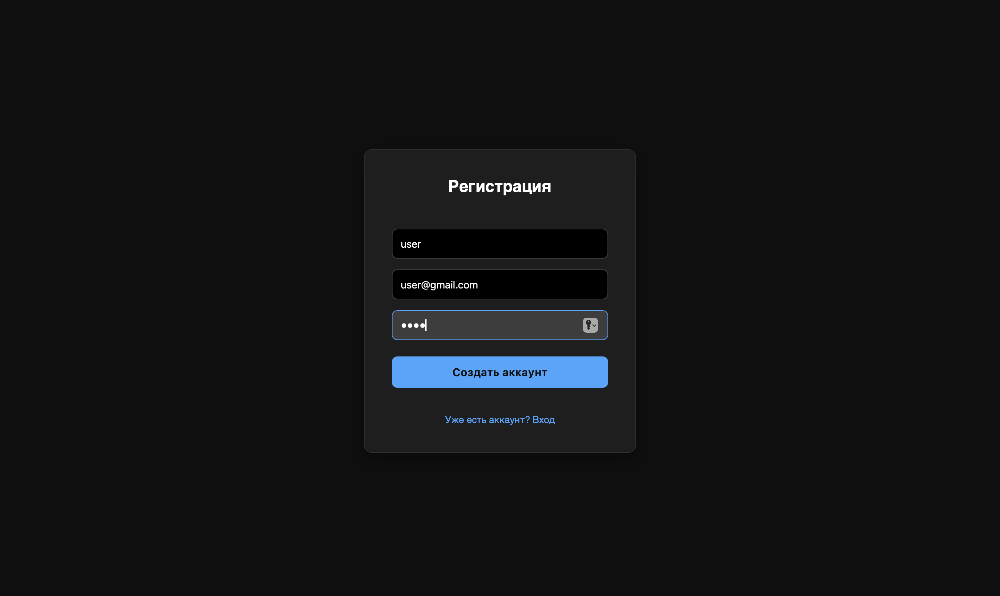
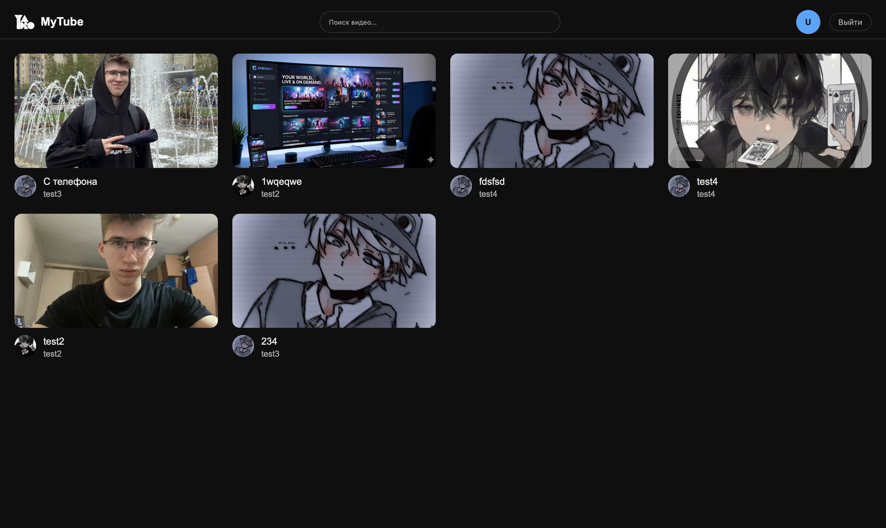
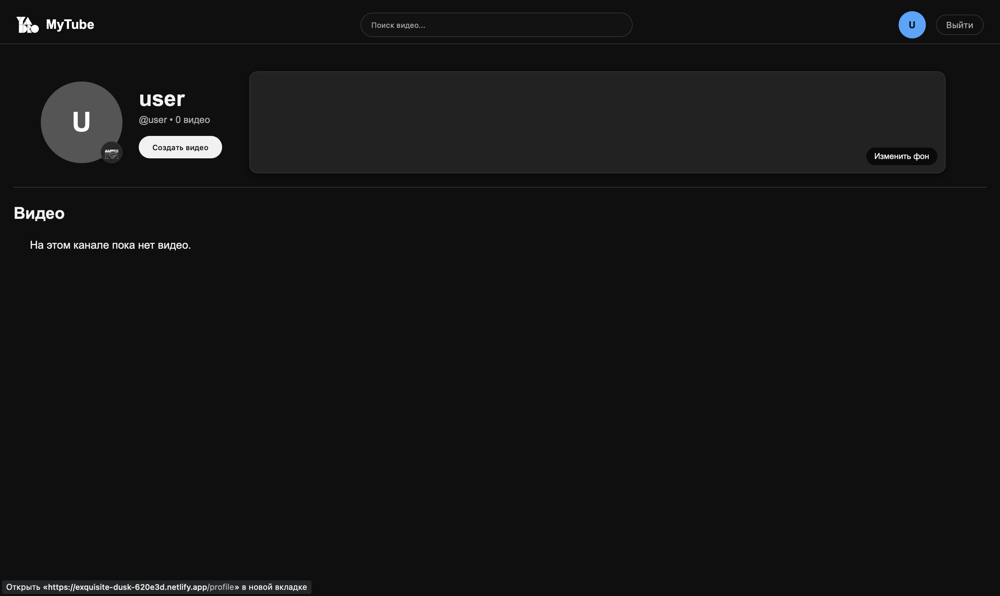
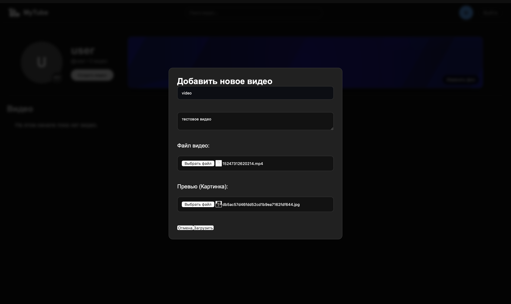
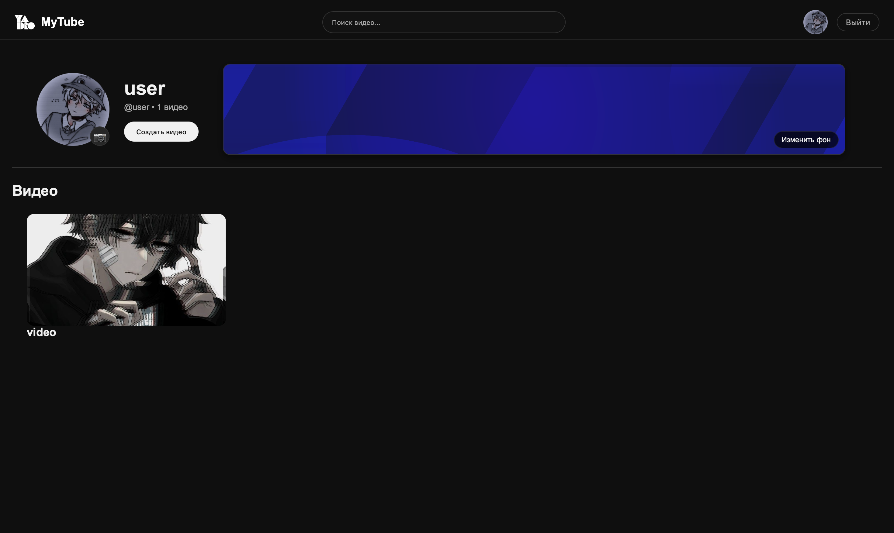
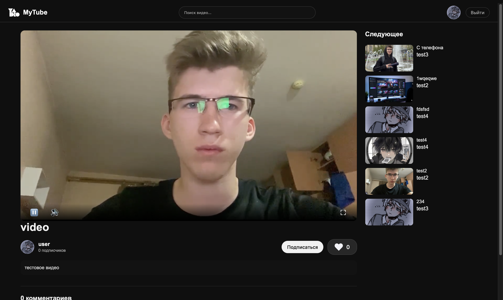
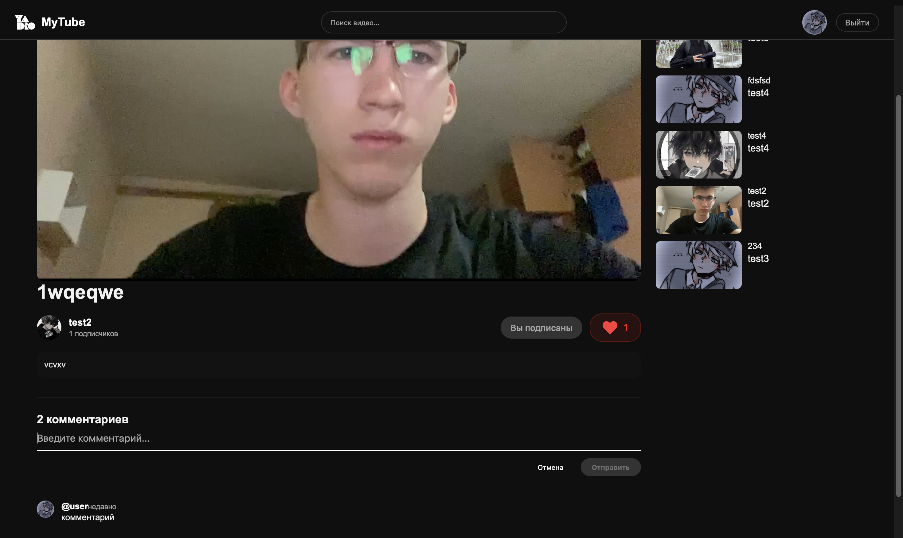

# 📺 MyTube — Видеоплатформа
Проект представляет собой клиент-серверное SPA-приложение: бэкенд на Django REST Framework работает как изолированный API, а фронтенд на React (Vite) отвечает за интерфейс и взаимодействие с пользователем.

---

## ⚡ Основные возможности

### 👤 Пользователи и Профили
* **Аутентификация:** Вход и регистрация с использованием Token-based аутентификации. Токен сохраняется в `localStorage` и автоматически подставляется в заголовки запросов.
* **Кастомизация каналов:** Настройка профиля пользователя — загрузка круглых аватарок и горизонтальных баннеров для фона канала.
* **Социальное взаимодействие:** Интерактивная система подписок на каналы других авторов с динамическим обновлением счетчиков.

### 🎬 Видео и Контент
* **Загрузка контента:** Загрузка видеофайлов (MP4) вместе с кастомными обложками-превью (Thumbnails) через `MultipartFormData`.
* **Кастомный плеер:** Собственный плеер для комфортного просмотра с управлением состоянием (Play/Pause по клику на экран, Mute, полноэкранный режим).
* **Реакции и фидбек:** Система лайков (иконки сердечек мгновенно меняют состояние без перезагрузки страницы) и интерактивные комментарии под видео.
* **Аналитика:** Автоматический инкремент и подсчет просмотров при воспроизведении.

### 🔍 Поиск и Навигация
* **Умный поиск:** Фильтрация видеороликов по названиям на главной странице в режиме реального времени.
* **Рекомендации:** Боковая панель связанных видео на странице просмотра для вовлечения пользователя.

---

## 🛠 Технологический стек

| Слой | Технологии |
| :--- | :--- |
| **Frontend** | React 18, Vite (сборщик), Axios, React Router DOM v6, CSS3 (Flexbox / Grid) |
| **Backend** | Python 3.10+, Django 5.0, Django REST Framework (DRF) |
| **Безопасность** | Token Authentication, Django CORS Headers |
| **База данных** | SQLite 3 (Локальная база данных разработки) |

---

## 📂 Структура проекта

Логическая структура папок разделена на независимые бэкенд и фронтенд части:

```text
RGR/
├── amvera.yml           # Конфигурационный файл сборки для Amvera Cloud
├── requirements.txt     # Список зависимостей Python для бэкенда
├── README.md            # Главный файл документации проекта
├── backend/             # Django REST API сервер
│   ├── core/            # Главные настройки проекта (settings.py, urls.py)
│   ├── db.sqlite3       # Локальная база данных SQLite
│   ├── manage.py        # Скрипт управления Django
│   ├── media/           # Хранилище загруженных видео, аватарок и баннеров
│   ├── venv/            # Виртуальное окружение Python
│   └── videos/          # Приложение Django: логика видео, лайков и профилей
├── frontend/            # React SPA приложение
│   ├── dist/            # Скомпилированный продакшен-билд фронтенда
│   ├── eslint.config.js # Настройки линтера ESLint
│   ├── index.html       # Главная HTML-страница
│   ├── node_modules/    # Локальные зависимости Node.js
│   ├── package-lock.json# Фиксация версий npm-зависимостей
│   ├── package.json     # Скрипты запуска и зависимости проекта
│   ├── public/          # Статические ресурсы (иконки, логотипы)
│   ├── src/             # Исходный код интерфейса (React компоненты)
│   └── vite.config.js   # Конфигурация сборщика Vite
└── report/              # Академическая отчетность по РГР (LaTeX)
    ├── RGR.pdf          # Скомпилированный готовый отчет в формате PDF
    └── RGR.tex          # Исходный код отчета на LaTeX
```

## 🚀 Деплой и Облачная инфраструктура

Проект успешно опубликован и доступен в глобальной сети. Архитектура развёртывания разделена на два независимых облака:

1. **Фронтенд (Client):** Развёрнут на платформе **Netlify**. Настроена автоматическая сборка при каждом коммите в ветку `main`.
   * **Публичный URL-адрес:** [https://exquisite-dusk-620e3d.netlify.app](https://exquisite-dusk-620e3d.netlify.app)
2. **Бэкенд (API & Media):** Развёрнут на облачной платформе **Amvera**. Сервер обрабатывает API-запросы, генерирует абсолютные ссылки для медиафайлов и хранит загружаемый пользователями контент.
   * **Базовый URL-адрес API:** `https://mutube-dreamshelter.amvera.io`

## 💻 Инструкция по локальному запуску

### Предварительные требования
Убедитесь, что на вашем компьютере установлены:
* **Python 3.10+**
* **Node.js 18+**
* **Git**

---


Откройте терминал, перейдите в папку, где вы хотите хранить проект, и склонируйте репозиторий:

```bash
git clone <https://github.com/ArtemLeshin/programming-in-C/tree/main/web_technologies/RGR>

# Переходим в директорию бэкенда
cd backend

# Создаем виртуальное окружение
python -m venv venv

# Активируем виртуальное окружение:
# Для macOS / Linux:
source venv/bin/activate
# Для Windows (в PowerShell):
.\venv\Scripts\Activate.ps1
# Для Windows (в Git Bash / Command Prompt):
source venv/Scripts/activate

# Устанавливаем необходимые Python библиотеки
pip install django djangorestframework django-cors-headers pillow

# Применяем миграции для создания структуры базы данных
python manage.py migrate

# Создаем суперпользователя (администратора) для доступа к панели /admin/
python manage.py createsuperuser

# Запускаем локальный сервер бэкенда
python manage.py runserver

Бэкенд-API успешно запустится по адресу: http://127.0.0.1:8000/
# Откройте второй терминал в VS Code (не закрывая первый с работающим Django):

# Переходим в директорию фронтенда
cd frontend

# Устанавливаем все необходимые Node.js зависимости из package.json
npm install

# Запускаем локальный сервер разработки Vite
npm run dev

Фронтенд-интерфейс успешно запустится по адресу: http://localhost:5173/
```
## 🔌 API Эндпоинты 

### 🎬 Видео и Взаимодействие

| Метод | Эндпоинт | Описание | Авторизация |
| :--- | :--- | :--- | :--- |
| **GET** | `/api/videos/` | Список всех видео (поддерживает поиск через `?search=`) | Нет |
| **POST** | `/api/videos/` | Загрузка нового видеоролика и превью (`MultipartFormData`) | Да (Token) |
| **POST** | `/api/videos/{id}/like/` | Поставить или снять лайк с видеоролика | Да (Token) |
| **GET** | `/api/videos/{id}/comments/` | Получение списка всех комментариев к видео | Нет |
| **POST** | `/api/videos/{id}/comments/` | Добавление нового комментария к видео | Да (Token) |

### 👤 Пользователи и Профили

| Метод | Эндпоинт | Описание | Авторизация |
| :--- | :--- | :--- | :--- |
| **POST** | `/api/register/` | Регистрация нового аккаунта пользователя | Нет |
| **POST** | `/api/login/` | Авторизация пользователя и получение токена доступа | Нет |
| **PATCH** | `/api/user/profile/` | Обновление горизонтального баннера в профиле канала | Да (Token) |
| **POST** | `/api/profile/update_avatar/` | Обновление круглой аватарки пользователя | Да (Token) |
| **POST** | `/api/subscribe/{user_id}/` | Подписка или отписка от канала выбранного автора | Да (Token) |

## Слайд 1: Авторизация

## Слайд 2: Регистрация

## Слайд 3: Главная страница

## Слайд 4: Страница пользователя после создания аккаунта

## Слайд 5: Добавление видео

## Слайд 6: Страница пользователя после настройки

## Слайд 7: Страница видео

## Слайд 8: Блок комментарии/подписки/лайка/описания

